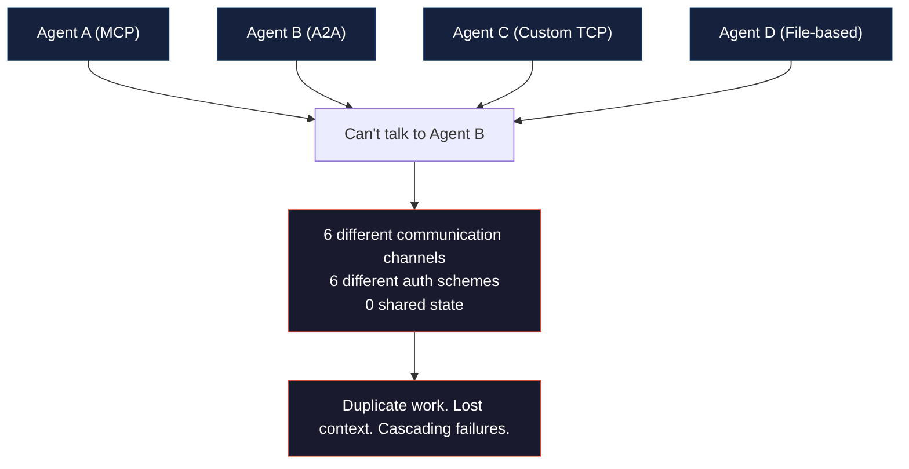
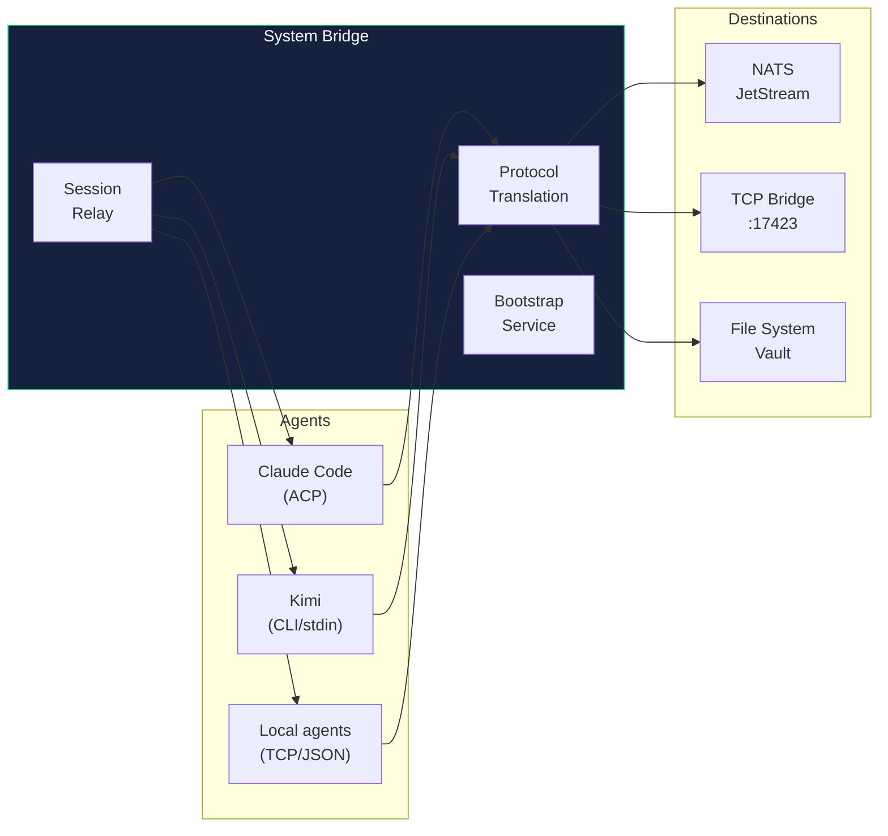

# System Bridge

[](https://opensource.org/licenses/MIT)
[](https://python.org)

**Connect every AI agent in your stack. One bridge for MCP, A2A, and custom communication protocols.**

---

> AI agents don't talk to each other by default. Every agent speaks its own protocol — MCP, A2A, custom TCP, HTTP, file-based. System Bridge is the translation layer: one bridge that lets any agent communicate with any other agent, regardless of protocol.

---

## The problem



## What System Bridge does

1. **Unified protocol translation** — agents using MCP, A2A, TCP, HTTP, or file-based comms all route through one bridge
2. **Cross-machine communication** — macOS, Linux, Docker, behind NAT or over Tailscale — one bridge handles routing
3. **Session relay** — real-time message forwarding with token auth and deduplication
4. **Bootstrap automation** — new agents automatically receive configuration, onboarding docs, and connection details



---

## Why not just [alternative]?

| Alternative | Problem | Why it fails |
|-------------|---------|-------------|
| One protocol only (e.g., MCP) | Locks you into a single agent ecosystem | Not all agents support MCP. A2A agents can't connect. Custom tools need custom protocols |
| Direct agent-to-agent TCP | Every connection needs separate auth, port, and format negotiation | 5 agents = 20 connection pairs to manage. Bridge reduces to N connections |
| NATS-only messaging | Requires NATS server and NATS-native agents | Great for pub/sub but doesn't translate legacy protocols. Bridge adds translation layer |
| Manually copying files between agents | No real-time delivery, constant conflicts | Agent A writes file → Agent B reads stale copy → Agent C overwrites. Chaos |

---

## Quick start

```bash
git clone https://github.com/nerudek/system-bridge
cd system-bridge

# Start the relay server
python3 templates/receiver-v5.py &

# Start the chat bridge
python3 templates/hermes-chat-bridge-v3.py --token your-shared-token &
```

---

## Agent compatibility

| Protocol | Bridge Support | Status |
|----------|---------------|--------|
| MCP (Model Context Protocol) | Full translation layer | ✅ |
| A2A (Agent-to-Agent) | Pass-through with auth | ✅ |
| ACP (Agent Communication Protocol) | Native support | ✅ |
| TCP/JSON (custom) | Bridge server :17423 | ✅ |
| File-based (Obsidian Vault) | Write with flock, atomic | ✅ |

---

## Repository structure

```
system-bridge/
├── templates/                    # Bridge implementations
│   ├── receiver-v5.py            # HTTP receiver
│   ├── hermes-chat-bridge-v3.py  # Chat bridge
│   └── hermes-relay-client.py    # Relay client
├── scripts/
│   └── mempalace_query.py        # Memory query tool
├── references/                   # Architecture docs
│   ├── agent-hierarchy.md
│   ├── nexus-launchd-services.md
│   └── tailscale-ssh-macos.md
├── README.md                     # THIS FILE
└── SKILL.md                      # Agent reference
```

---

## Known problems

| Problem | Status | Workaround |
|---------|--------|------------|
| No persistent message queue — bridge is real-time only | By design | For persistence, pair with NATS JetStream |
| Python-only implementations | Open | Go/Rust ports welcome |
| Launchd-managed daemons restart on kill | Documented | Use `launchctl unload`, not `kill` |

---

## Contributing

PRs welcome for: additional protocol translations, Go/Rust bridge implementations, persistent message queue support, automated tests.

---

## License

MIT — see [LICENSE](LICENSE).

---

*Built by [nerudek](https://github.com/nerudek)*

☕ **Support:** [PayPal.me/nerudek](https://www.paypal.me/nerudek) | [Dev.to](https://dev.to/nerudek)
